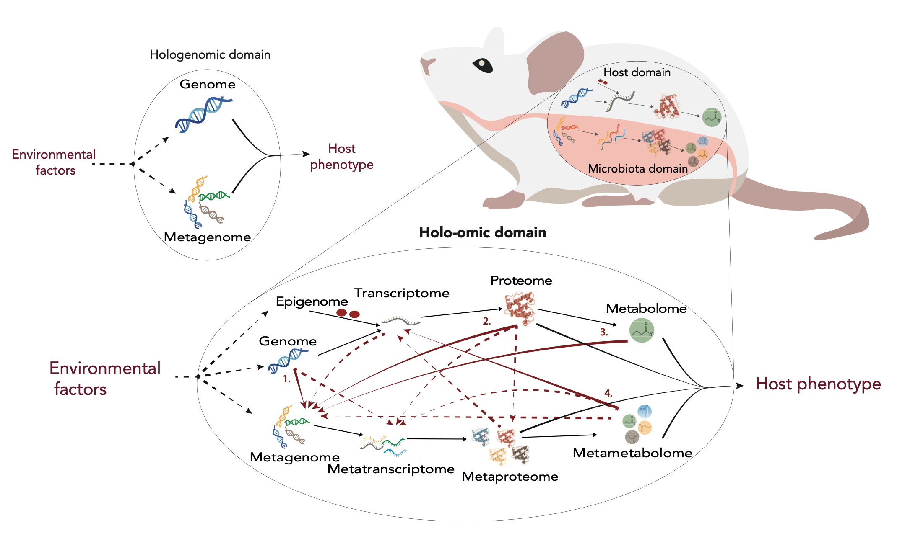

# About this guidebook {- #about-this-guidebook}



\scriptsize
:::: {.imagenote}
Holo-omics overview. Modified from Nyholm et al. 2020 [@Nyholm2020-ua]
:::
\normalsize

The **practical guide to holo-omics** is a compilation of methodological procedures to generate, analyse and integrate holo-omic data, i.e., multi-omic data jointly generated from hosts and associated microbial communities [@Nyholm2020-ua; @Limborg2018-tf]. This guide extends the contents of the article **"A practical introduction to holo-omics"**, which aims at guiding researchers to the main critical steps and decision points to perform holo-omic studies. While the article focuses on discussing pros and cons of using multiple available options, the aim of this guide is to compile protocols and pipelines to be implemented by researchers. The **practical guide to holo-omics** is presented in two formats:

* Website (http://www.holo-omics.science/)
* PDF document (http://www.holo-omics.science/holo_omics_guidebook.pdf)

The guidebook is meant to be a live resource under continuous development, whose contents are updated, replaced and improved as technology and knowledge advances. So, changes are to be expected. However, frozen PDF versions will be released periodically to ensure traceability of the contents.

:::: {.graybox}
This guide is presented as a final output of the H2020 project HoloFood. More information about this EU Innovation Action that ran between 2019 and 2023 can be found in the [HoloFood Website](http://www.holofood.eu) and the [CORDIS website](https://cordis.europa.eu/project/id/817729).  
:::

### Contents {-}

* **[Introduction](#holo-omics)**: general information about holo-omics, employed data types and study design considerations.
* **[Laboratory procedures](#about-labwork)**: methods and procedures for generating raw omic data of hosts and microbial communities.
* **[Bioinformatic procedures](#about-bioinformatics)**: methods and procedures for processing raw omic data into quantitative datasets to be analysed through statistics.
* **[Statistical procedures](#about-statistics)**: methods and procedures for analysing and integrating holo-omic data.

### Protocols, exercises and tutorials {- #protocols-exercises-tutorials}

This guide contains example data and bits of code (mostly shell and R) to reproduce data generation and analysis procedures. Code boxes look like the following:

\small
```{r eval=FALSE}
shao4d_perm <- shao4d %>%
  tax_transform("identity", rank = "genus") %>%
  dist_calc("aitchison") %>%
  dist_permanova(
    variables = c("breed", "sex", "number_reads"),
    n_perms = 99, # you should use more permutations in your real analyses!
    n_processes = 1
  )
#> Dropping samples with missings: 15
#> 2022-11-24 01:15:20 - Starting PERMANOVA with 99 perms with 1 processes
#> 2022-11-24 01:15:21 - Finished PERMANOVA
```
\normalsize

### Data sets {- #datasets}

The data sets employed in the guidebook are derived from chicken and salmon intestinal samples produced in the H2020 project HoloFood. All the raw omic data, as well as relevant metadata and complementary information can be found in the **[HoloFood Data Portal](https://www.holofooddata.org)**.

### About the authors {-}

The authors of the **Practical Guide to Holo-omics** belong primarily to the [Center for Evolutionary Hologenomics](https://ceh.ku.dk/), at the Globe Institute of the University of Copenhagen (Denmark). The CEH is a research centre dedicated to studying host-microbiota interactions and their impact on basic and applied biological processes.

#### Antton Alberdi {- #antton-alberdi}
Antton is an Associate Professor at the University of Copenhagen whose research is focused on understanding how animal-microbiota interactions shape basic and applied biological processes. Antton is the corresponding author of the **Practical Guide to Holo-omics**.

:::: {.tipbox}
[antton.alberdi@sund.ku.dk](antton.alberdi@sund.ku.dk) | [www.alberdilab.dk](www.alberdilab.dk)
:::

#### Morten Limborg {- #morten-limborg}
Morten is an Associate Professor at the University of Copenhagen and the Head of the Section for Hologenomics at the Globe Institute. His research focuses on host-microbiota interactions in aquaculture fish species.

#### Raphael Eisenhofer {- #raphael-eisenhofer}
Raphael is a postdoctoral researcher working under the supervision of Alberdi. His research activity is mainly focused on metagenomic analyses and related tool development, as well as marsupial microbiome analysis.

#### Iñaki Odriozola {- #inaki-odriozola}
Iñaki is a postdoctoral researcher working at the Alberdi lab. He implements his statistical background in community ecology to multi-omic data integration in host-microbiota systems.

#### Jacob A Rasmussen {- #jacob-rasmussen}
Jacob is a postdoctoral researcher supervised by Limborg. He researches on fish-microbiota interactions using multi-omic tools, including genomics, metagenomics and metabolomics.

#### Protocol and script contributors {-}

* Carlotta Pietroni, University of Copenhagen
* Jorge Langa, University of Copenhagen

#### Other relevant people {-}

* Tom Gilbert (HoloFood project coordinator), University of Copenhagen
* Anna Fotaki (HoloFood project manager), University of Copenhagen

### How to cite this work {-}
Instructions to cite this work will be eventually added.

### Acknowledgement {-}

This project has received funding from the European Union's Horizon 2020 research and innovation programme under grant agreement No 817729.
